# Secure Ticketing & Reservation API

### System Design Document

[](https://openjdk.org/)
[](https://spring.io/projects/spring-boot)
[](https://www.jacoco.org/)
[]()
[](https://www.postgresql.org/)
[](https://redis.io/)
[](https://railway.app/)

> **🚀 Live Swagger UI:** https://secureticketingreservationapi-production.up.railway.app/swagger-ui/index.html — full API available, no local setup required. See [Live Deployment](#-live-deployment-railway) for the end-to-end scenario.
---

## Table of Contents

- [Introduction](#introduction)
- [Project Plan](#project-plan)
  - [Functional Requirements](#functional-requirements)
  - [Non-Functional Requirements](#non-functional-requirements)
  - [Capacity & Load Estimation](#capacity--load-estimation)
  - [API Design](#api-design)
  - [Database Design](#database-design)
  - [High-Level Architecture](#high-level-architecture)
  - [Dive Into Key Components](#dive-into-key-components)
  - [Scalability, Fault Tolerance & Reliability](#scalability-fault-tolerance--reliability)
- [Developer Guide](#developer-guide)
  - [Project Structure](#project-structure)
  - [Requirements](#requirements)
  - [How to Run](#how-to-run)
  - [Testing](#testing)
  - [Static & Security Code Analysis](#static--security-code-analysis)
- [Future Improvements](#future-improvements)

---

## Introduction

The Secure Ticketing & Reservation API is a backend service built to handle event management and ticket reservation under real-world constraints. The system addresses three core problems that any production ticketing platform must solve: concurrent users booking the last available seat at the same moment, duplicate requests arriving due to network retries, and the need to enforce strict access boundaries across different user roles.

The service exposes a RESTful API secured with stateless JWT authentication, role-based authorization enforced at the method level, and a concurrency model that uses pessimistic database-level locking rather than application-level synchronization. Every reservation write passes through an idempotency layer that detects duplicate submissions and replays the original response without re-executing the business logic.

---

## Project Plan

### Functional Requirements

**1. User Management**
- Users can register with an email and password
- Three roles are supported: ADMIN, ORGANIZER and CUSTOMER
- Login returns a short-lived access token (15 minutes) and a long-lived refresh token (7 days)
- Access tokens can be renewed using the refresh endpoint without re-authentication

**2. Event Management**
- Organizers can create, update and publish events
- Events have a title, venue, start/end time and a total capacity
- Published events are visible to all users without authentication
- Published events cannot be modified

**3. Reservation Engine**
- Customers can create, confirm and cancel reservations
- The system must prevent overselling under concurrent booking attempts
- Reservations in CONFIRMED status cannot be cancelled
- All reservation actions are recorded in an audit log

**4. Idempotency**
- POST requests that include an `Idempotency-Key` header are processed exactly once
- Duplicate requests with the same key return the original response without re-processing

**5. Rate Limiting**
- The login endpoint is rate-limited to 10 requests per minute
- Clients exceeding the limit receive a `429 Too Many Requests` response

**6. Audit Logging**
- Every reservation lifecycle action is written to an audit log asynchronously
- Audit records are preserved even if the triggering transaction rolls back

---

### Non-Functional Requirements

| Category | Requirement |
|----------|-------------|
| Security | BCrypt (cost 12), JWT HS512, constant-time hash comparison (CWE-203), CORS |
| Concurrency | Pessimistic locking (SELECT FOR UPDATE) at DB level — works in multi-instance deployments |
| Observability | Actuator health/info endpoints, authenticated health details, audit log trail |
| Testability | 91% coverage, concurrency test with 20 threads, full filter chain integration tests |
| Scalability | DB-level locking for horizontal scaling, Redis cache for public event reads |

---

### Capacity & Load Estimation

**Expected Traffic Profile**
- Normal load: ~50 concurrent users browsing and reserving tickets
- Peak load: ~500 concurrent users during high-demand event releases
- Reservation burst: up to 200 booking requests per second at peak
- Read/write ratio: ~80% reads / 20% writes

**Request Volume Estimates**

| Endpoint | Estimated RPS (peak) | Notes |
|----------|---------------------|-------|
| GET /api/events/public | 150 | Cached in Redis, 5-min TTL |
| POST /api/reservations | 200 | Pessimistic lock, DB write |
| POST /api/auth/login | 10 (limited) | Rate limited by Resilience4j |
| POST /api/reservations/{id}/confirm | 80 | DB write + audit log |
| GET /api/reservations/my | 50 | Authenticated, DB read |

**Storage Estimation**
- Average reservation record: ~400 bytes
- Average audit log record: ~300 bytes
- Idempotency key with response body: ~2–5 KB (TTL cleanup)
- At 1 million reservations: ~400 MB reservations + ~300 MB audit logs

**Caching Impact**
- Public event listings cached in Redis with 5-minute TTL
- At 150 read RPS, caching eliminates ~90% of repeated DB queries
- Cache invalidation triggered on every event create, update, or publish via `@CacheEvict`

---

### API Design

| Method | Path | Role | Description |
|--------|------|------|-------------|
| POST | `/api/auth/register` | Public | Register a new user |
| POST | `/api/auth/login` | Public | Authenticate, receive JWT tokens |
| POST | `/api/auth/refresh` | Public | Refresh access token |
| GET | `/api/events/public` | Public | Browse published events (cached) |
| GET | `/api/events/{id}` | Authenticated | Get event by ID |
| GET | `/api/events` | ORGANIZER / ADMIN | List events (paginated) |
| POST | `/api/events` | ORGANIZER / ADMIN | Create a draft event |
| PUT | `/api/events/{id}` | ORGANIZER / ADMIN | Update a draft event |
| POST | `/api/events/{id}/publish` | ORGANIZER / ADMIN | Publish a draft event |
| POST | `/api/events/{eventId}/reservations` | CUSTOMER / ADMIN | Create a reservation |
| POST | `/api/reservations/{id}/confirm` | Authenticated | Confirm a pending reservation |
| POST | `/api/reservations/{id}/cancel` | Authenticated | Cancel a reservation |

---

### Database Design

| Table | Purpose |
|-------|---------|
| `users` | Credentials, roles, last login timestamp |
| `events` | Event definitions with capacity, dates, published flag |
| `reservations` | Reservation state (PENDING / CONFIRMED / CANCELLED) |
| `audit_logs` | Append-only log of every reservation action |
| `idempotency_keys` | Request hashes and response bodies for deduplication |

#### Data Model

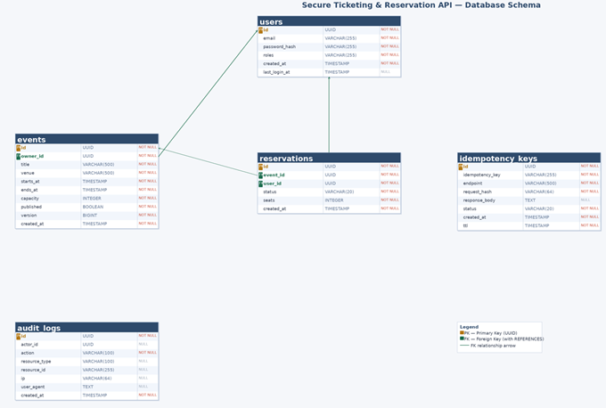

Schema is managed by Flyway:
- `V1__init_schema.sql` — all tables and indexes
- `V2__seed_users.sql` — admin, organizer, customer seed users

---

### High-Level Architecture

The application follows a layered architecture: filter chain, controller, service, and repository. Cross-cutting concerns such as security, audit logging, and idempotency are handled outside the business logic layer using Spring Security filters and AOP aspects.

#### Architecture Diagram

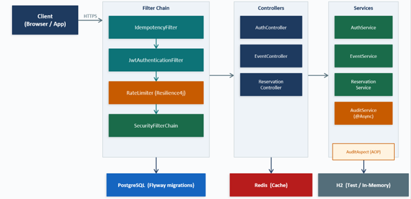

#### Request Lifecycle / Filter Chain

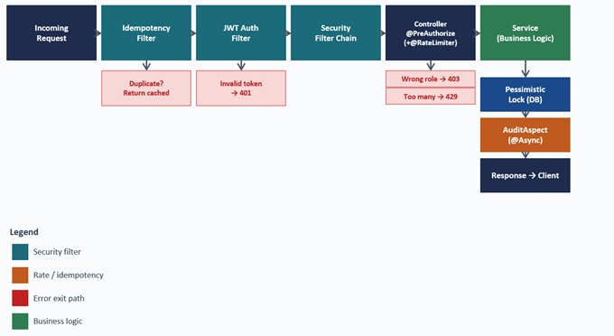

#### Reservation Flow — Pessimistic Locking

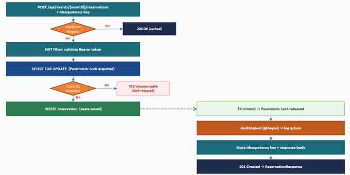

#### JWT Authentication Flow

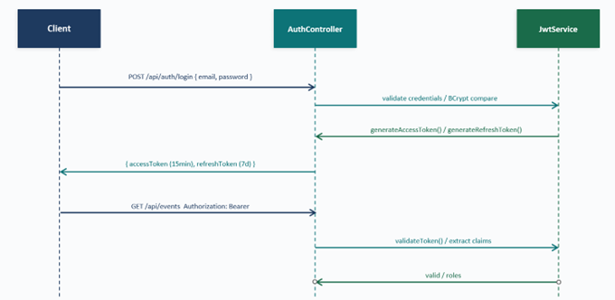

#### Sequence Diagram — Create Reservation

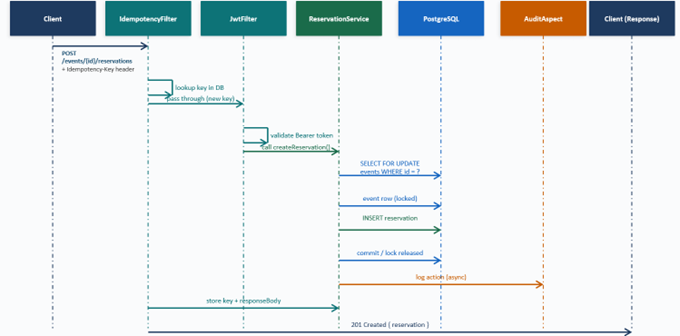

---

### Architectural Decisions

**ADR-01: Pessimistic Locking for Oversell Prevention**  
`SELECT FOR UPDATE` is applied to the event row during reservation creation. This provides a deterministic guarantee that only one transaction can modify available capacity at a time. Optimistic locking with retry was considered but rejected due to unpredictable latency under contention and the complexity of retry orchestration.

**ADR-02: Idempotency via Database**  
Idempotency keys and response bodies are stored in PostgreSQL rather than Redis. The database is already the system of record, and storing idempotency data there provides ACID guarantees at no additional operational cost.

**ADR-03: Async AOP Audit Logging with REQUIRES_NEW**  
Audit records are written through an AOP aspect using `@Async` and `REQUIRES_NEW` transaction propagation. This ensures audit writes do not block the main business transaction and are committed independently, even if the parent transaction rolls back.

**ADR-04: Native SQL for Published Event Queries**  
The `findPublished` repository method uses a native SQL query rather than JPQL. PostgreSQL requires explicit type casts on nullable parameters in prepared statements which JPQL's Hibernate dialect does not handle transparently.

---

### Dive Into Key Components

**JwtAuthenticationFilter** — Runs on every request before the controller. Reads the Bearer token from the Authorization header, validates it via JwtService, and loads the user into the SecurityContext. Open endpoints like `/api/auth/**` are unaffected.

**IdempotencyFilter** — Applies only to POST requests with an `Idempotency-Key` header. Hashes the request body and checks the `idempotency_keys` table. If a completed record exists with the same hash, the cached response is returned immediately without touching the controller.

**SecurityConfig** — Sets up the Spring Security filter chain: stateless sessions, CSRF disabled, JwtAuthenticationFilter added before the default auth filter. Fine-grained role checks are handled per method with `@PreAuthorize`.

**JwtService** — Generates access tokens (15 min) and refresh tokens (7 days) signed with HS512. Both carry userId, email, roles and a type claim. The type claim prevents a refresh token from being used as a bearer token for protected endpoints.

**ReservationService** — The most concurrency-sensitive component. Acquires a `PESSIMISTIC_WRITE` lock on the event row (`SELECT FOR UPDATE`), sums active seats, and compares against capacity — all inside a single transaction. If capacity is exceeded, a `BusinessException` is thrown and the lock is released on rollback.

**AuditAspect** — An `@AfterReturning` AOP pointcut on all state-changing service methods. Captures actor, action, resource ID, IP, and User-Agent, then calls `AuditService.log()` which runs `@Async` in a `REQUIRES_NEW` transaction. Audit failures are silently caught so they never roll back the main operation.

**GlobalExceptionHandler** — A `@RestControllerAdvice` that maps all exceptions to structured error responses. Stack traces never reach the client.

**Resilience4j Rate Limiter** — Applied to the login endpoint via `@RateLimiter` annotation. Configured at 10 requests per minute with zero wait time. Rejected requests hit a fallback that throws `RateLimitException`, mapped to 429.

---

### Scalability, Fault Tolerance & Reliability

**Scalability**
- Stateless by design — no session data in memory, multiple instances work without coordination
- Pessimistic locking serializes writes at DB level regardless of instance count
- Redis cache eliminates repeated DB reads for public event listings
- Rate limiting can be replaced with Redis-backed limiter for multi-instance protection

**Fault Tolerance**

| Scenario | What happens |
|----------|-------------|
| Invalid JWT | Filter catches the exception, passes through, Spring Security returns 401 |
| Duplicate request | Idempotency filter returns cached response before controller runs |
| Concurrent oversell | Only one transaction gets past the capacity check, rest receive 422 |
| Audit failure | AuditAspect swallows errors silently, main transaction unaffected |
| Redis down | Cache misses fall through to PostgreSQL, application keeps working |

**Reliability**
- Every write wrapped in `@Transactional` — failed operations roll back completely
- `@Version` field on Event prevents silent last-write-wins overwrites
- Flyway applies migrations in order with checksum tracking
- AuditLog rows are insert-only, never updated or deleted
- GlobalExceptionHandler maps every exception to a clean JSON response

---

## Developer Guide

### Project Structure

```
com.ticketing.reservation
├── controller/        AuthController, EventController, ReservationController
├── service/           AuthService, EventService, ReservationService, AuditService
├── security/          JwtService, JwtProperties, UserPrincipal, UserDetailsServiceImpl
├── filter/            JwtAuthenticationFilter, IdempotencyFilter
├── aspect/            AuditAspect (@AfterReturning AOP)
├── config/            SecurityConfig, OpenApiConfig, RedisConfig
├── domain/entity/     User, Event, Reservation, AuditLog, IdempotencyKey
├── domain/enums/      ReservationStatus, Role
├── dto/               request/, response/
├── repository/        UserRepository, EventRepository, ReservationRepository, ...
└── exception/         GlobalExceptionHandler, BusinessException, ...
```

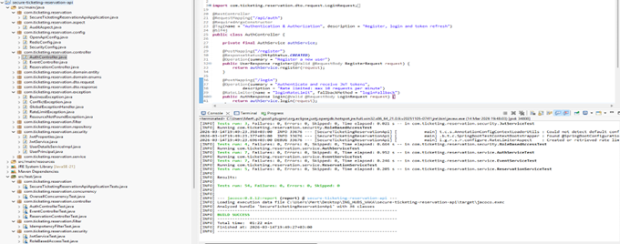

---

### Requirements

- Java 21+
- Spring Boot 4
- Maven 3.9+
- Docker Desktop (for PostgreSQL and Redis via docker-compose)
- Internet — required on first build to download dependencies
- IDE: Eclipse, IntelliJ IDEA, or VS Code

---

### How to Run

#### 1. Start Infrastructure

```bash
docker-compose up -d
```

This starts:
- `ticketing-postgres` — PostgreSQL 16 on port 5432
- `ticketing-redis` — Redis 7 on port 6379

Flyway runs `V1__init_schema.sql` and `V2__seed_users.sql` automatically on first startup. No manual DB setup needed.

> ⚠️ **Note:** The `Dockerfile` contains hardcoded Railway connection strings and is intended for cloud deployment only. For local development, use `mvn spring-boot:run` or your IDE — do not build the Docker image locally.

#### 2. Build and Run

**Option A — Terminal**
```bash
mvn clean install
mvn spring-boot:run
```

**Option B — IDE**
- Open `SecureTicketingReservationApiApplication.java`
- Run As → Java Application

Application starts at `http://localhost:8080`

#### 3. Open Swagger UI

```
http://localhost:8080/swagger-ui/index.html
```

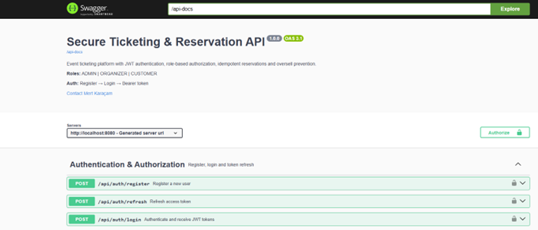

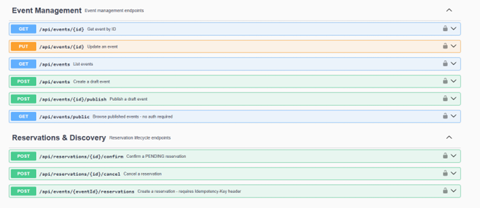

#### 4. Seed Users

| Email | Password | Role |
|-------|----------|------|
| admin@ticketing.com | Admin123! | ADMIN |
| organizer@ticketing.com | Organizer123! | ORGANIZER |
| customer@ticketing.com | Customer123! | CUSTOMER |

#### 5. Authentication Flow

**1. Register** (optional — seed users already exist)
```json
POST /api/auth/register
{ "email": "test@example.com", "password": "Test@12345!", "role": "CUSTOMER" }
```

**2. Login**
```json
POST /api/auth/login
{ "email": "organizer@ticketing.com", "password": "Organizer123!" }
```
Response:
```json
{ "accessToken": "...", "refreshToken": "...", "tokenType": "Bearer", "expiresIn": 900 }
```

**3. Authorize in Swagger**  
Click the **Authorize** button, paste the `accessToken` value. All subsequent requests will include the token automatically.

**4. Refresh token**
```json
POST /api/auth/refresh
{ "refreshToken": "..." }
```

#### 6. Example API Calls

**Create an event (ORGANIZER)**
```json
POST /api/events
Idempotency-Key: event-001
{
  "title": "Spring Boot Workshop",
  "venue": "Istanbul Tech Hub",
  "startsAt": "2026-06-15T14:00:00Z",
  "endsAt": "2026-06-15T18:00:00Z",
  "capacity": 100
}
```

**Publish the event**
```
POST /api/events/{id}/publish
```

**Make a reservation (CUSTOMER)**
```json
POST /api/events/{eventId}/reservations
Idempotency-Key: res-001
{ "seats": 2 }
```

#### 7. Actuator

Spring Boot Actuator exposes two endpoints:

- `GET /actuator/health` — application health including DB and Redis connectivity. Authenticated users receive full component details; unauthenticated requests return UP/DOWN only.
- `GET /actuator/info` — application metadata.

The `/actuator/metrics` endpoint is intentionally excluded from public exposure.

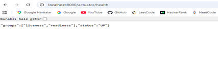

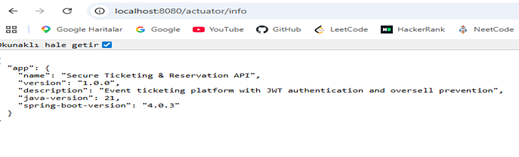

---

### 🚀 Live Deployment (Railway)

**Live Swagger UI:**  
🔗 [https://secureticketingreservationapi-production.up.railway.app/swagger-ui/index.html](https://secureticketingreservationapi-production.up.railway.app/swagger-ui/index.html)

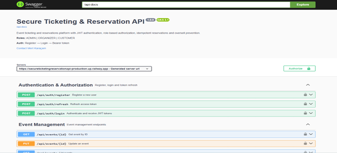

**Happy Path — End-to-End Scenario**

```
Step 1 — Register as Organizer
POST /api/auth/register
{ "email": "organizer@test.com", "password": "Test@12345!", "role": "ORGANIZER" }
→ 201 Created: { "id": "c6b72439-...", "roles": "ORGANIZER" }

Step 2 — Login and Receive JWT
POST /api/auth/login | { "email": "organizer@test.com", "password": "Test@12345!" }
→ 200 OK: { "accessToken": "eyJhbGci...", "expiresIn": 900 }

Step 3 — Create and Publish an Event
POST /api/events | { "title": "ING Tech Summit 2026", "venue": "Levent Arena Istanbul",
  "startsAt": "2026-09-10T09:00:00Z", "endsAt": "2026-09-10T18:00:00Z", "capacity": 200 }
→ 201 Created: { "id": "0bc8bd27-...", "published": false }

POST /api/events/0bc8bd27-.../publish
→ 200 OK: { "published": true, "version": 1 }

Step 4 — Customer Reserves Seats (with Idempotency-Key)
POST /api/events/0bc8bd27-.../reservations | Idempotency-Key: res-001 | { "seats": 3 }
→ 201 Created: { "id": "e7eb0874-...", "status": "PENDING", "seats": 3 }

Step 5 — Confirm the Reservation
POST /api/reservations/e7eb0874-.../confirm
→ 200 OK: { "status": "CONFIRMED", "seats": 3 }
```

---

### Testing

```bash
# Run all tests
mvn test

# Generate JaCoCo coverage report
mvn test jacoco:report
# Report at: target/site/jacoco/index.html
```

**Test suite — 54 tests:**

| Category | Tests |
|----------|-------|
| Unit | ReservationServiceTest, EventServiceTest, AuthServiceTest, JwtServiceTest, IdempotencyFilterTest |
| Integration (H2) | AuthControllerTest, EventControllerTest, ReservationControllerTest |
| Security | RoleBasedAccessTest — CUSTOMER cannot create events, unauthenticated cannot access protected endpoints |
| Concurrency | OversellConcurrencyTest — 20 threads competing for 10 seats, asserts total active seats never exceed capacity |

#### Test Coverage — 91%

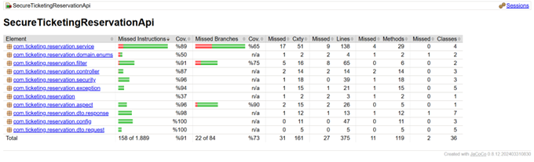

---

### Static & Security Code Analysis

Two analysis tools were run against the codebase to catch issues that automated tests alone would not surface.

#### Static Code Analysis (PMD)

```bash
mvn pmd:check
```

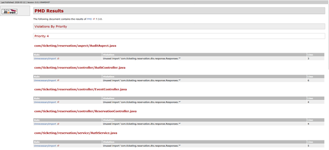

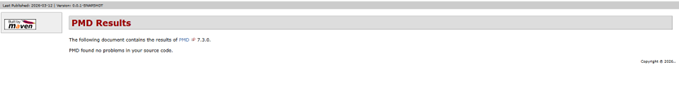

**Result: 0 violations** after removing unused wildcard imports across 7 files.

---

#### Security Code Analysis (SpotBugs + Find Security Bugs)

```bash
mvn spotbugs:spotbugs
mvn spotbugs:gui
```

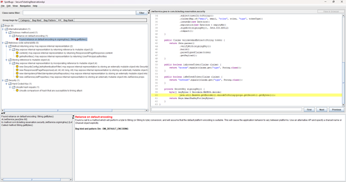

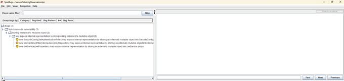

**5 issues resolved:**

| Issue | Fix |
|-------|-----|
| `DM_DEFAULT_ENCODING` | `JwtService.getBytes()` — fixed with `StandardCharsets.UTF_8` |
| `EI_EXPOSE_REP` | `UserPrincipal.getAuthorities()` — wrapped with `Collections.unmodifiableCollection()` |
| `UNSAFE_HASH_EQUALS (CWE-203)` | `IdempotencyFilter` timing attack — fixed with `MessageDigest.isEqual()` |
| `DM_DEFAULT_ENCODING` (x2) | Additional charset issues resolved |

**3 documented false positives remaining:**  
`EI_EXPOSE_REP2` warnings on Spring-managed singleton beans (`SecurityConfig`, `JwtService`, `IdempotencyFilter`). SpotBugs flags constructor injection storing an external reference, but Spring controls the lifecycle of these beans — no external mutation is possible. Suppressing with `@SuppressFBWarnings` would hide the signal for future classes, so they are left open with this explanation.

---

## Future Improvements

- **Distributed rate limiting** — replace in-process Resilience4j with a Redis-backed limiter for multi-instance deployments
- **Waitlist support** — notify customers automatically when a cancellation frees seats
- **Event cancellation** — organizer-initiated cancellation with automatic reservation rollback
- **Kafka integration** — event-driven reservation flow with outbox pattern
- **Token blacklist** — store invalidated tokens in Redis on logout
- **Prometheus / Grafana** — custom metrics dashboard (reservation rate, cache hit ratio)

---

## Author

**Mert Karaçam**
